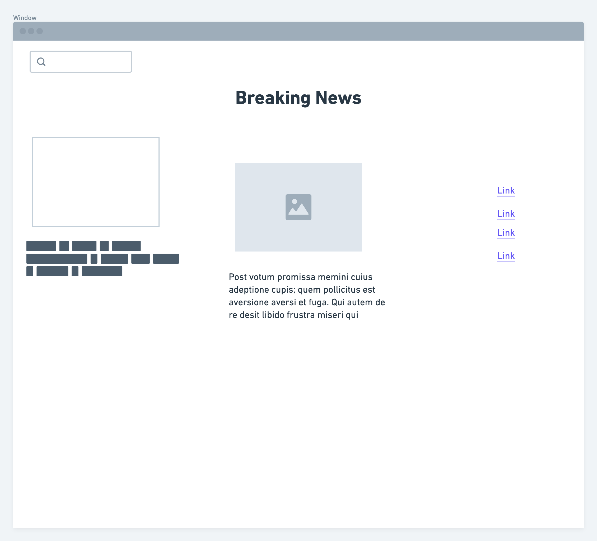

# **Breaking News**


<br>

### Overview

_**Breaking News** is going to be an outlet for the top trending headlines across multiple sources. Featuring a blog-like format, it will display the top news in the country. There will also be an option to search for articles using specific keywords._

<br>

### Wireframes




<br>

### MVP

_The **Breaking News** MVP will be using React to create the website. The goal is to make the site look less like a generic news site. On the side or somewhere, the empty space will display the current weather. Breaking News will be implemented on different screen sizes. Finally the site will be deployed. At least 5 reusable components will be built using Storybook._

<br>

#### Data

|     API     | Quality Docs? | Website                  | Sample Query                                                                 |
| :---------: | :-----------: | :----------------------- | :--------------------------------------------------------------------------- |
|  News API   |      yes      | _newsapi.org_            | _newsapi.org/v2/top-headlines_                                               |
| Weather API |      yes      | _openweathermap.org/api_ | _api.openweathermap.org/data/2.5/weather?q={city name}&appid={your api key}_ |

<br>

#### Component Hierarchy

```
src
|__ assets/
      |__ buttons
      |__ fonts
      |__ graphics
      |__ images
|__ components/
      |__ Header.js
      |__ Search.js
      |__ Main.js
      |__ Side.js
      |__ Weather.js
      |__ Footer.js
```

<br>

#### Post-MVP Goals

- _Allow users to save articles for later._
- _Show quick sharing options._
